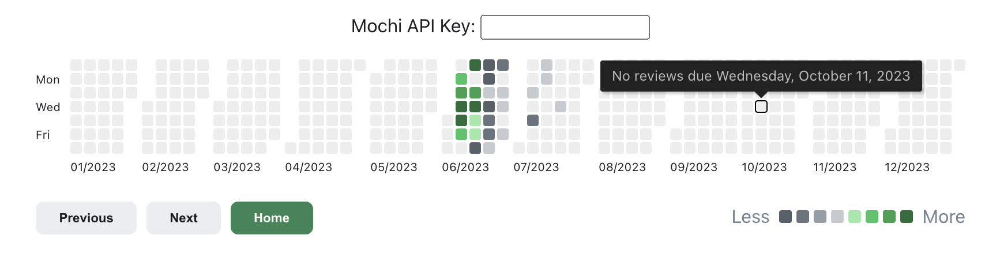

# mochi-heatmap

A heatmap graph that integrates with [Mochi Cards](https://mochi.cards) to visualize your historical flashcard reviews and pending reviews.

Requires an [API key](https://mochi.cards/docs/api/#authentication) (and so Pro account) to use. Inspired by [this](https://github.com/glutanimate/review-heatmap) Anki plugin.

Note: due to Mochi API limitations, there is currently no consideration of 'new cards' for the current day; only past/future known reviews are counted.